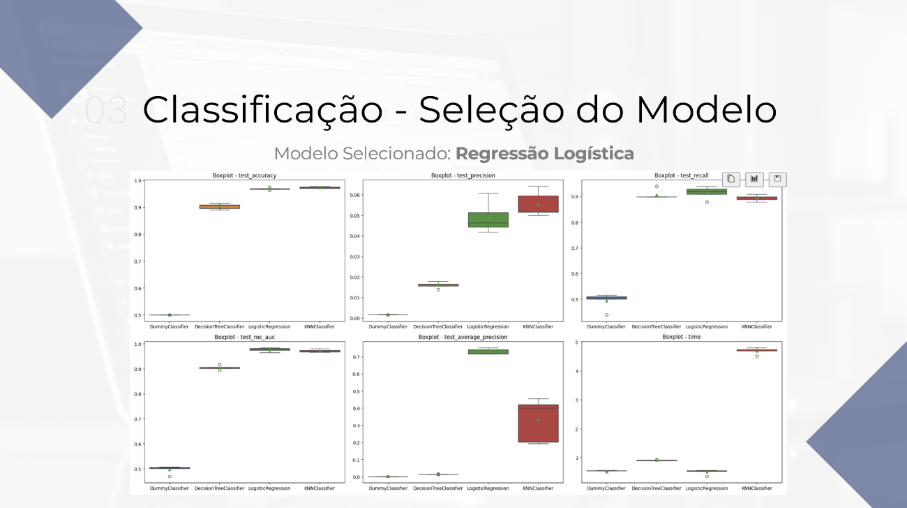
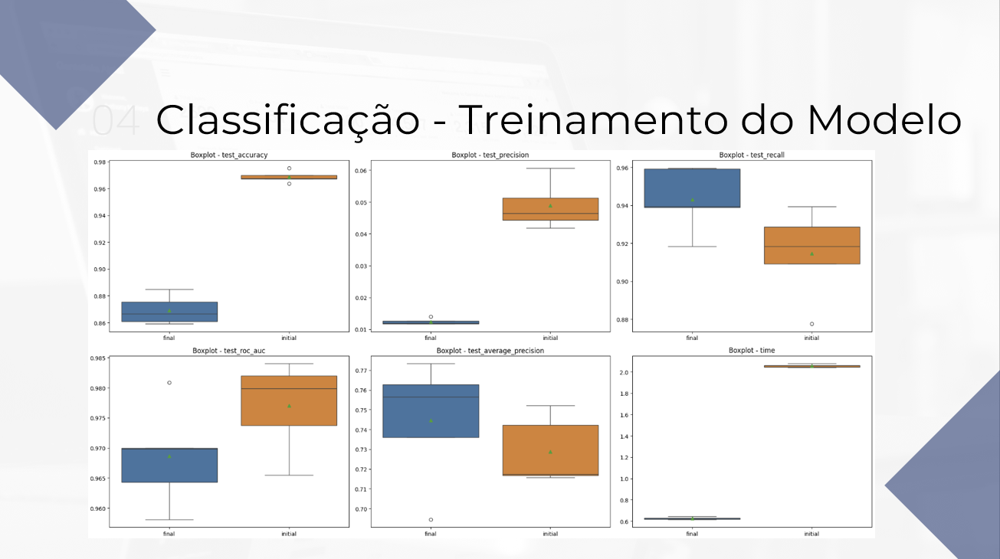

# Ciência de Dados - Projeto Final 3

## Projeto
**Modelo de classificação** de fraude em transações financeiras em um banco.

## Objetivo
O objetivo do projeto é, a partir dos dados fornecidos pela equipe de Fraudes, construir um **modelo de classificação** para identificação de fraudes em transações financeiras em um banco.  

A inteção é que o modelo possa prever quais transações são fraudes, permitindo que a empresa identifique as transações fraudulentas, e assim possa evitar prejuízos potencialmente muito elevados.

## Descrição
Nesse projeto de Ciência de Dados, foi criado um modelo de classificação usando Regressão Logística para prever se uma transação financeira é ou não fraude em uma instituição financeira. Para isso foram analisadas as principais métricas de avaliação dos modelos de classificação como: ROC-AUC, AUPRC, Recall, Precision, Accuracy e Time, para selecionar o melhor modelo para esse projeto. Além disso, como esse projeto de identificação de fraudes tem um dataset altamente desbalanceado, uma ação interessante seria criar modelos para diferentes faixas de valores de transações. Dessa forma, é possível equilibrar o investimento em uma equipe de prevenção a fraudes e ainda assim identificar as fraudes com os valores mais altos e que podem causar um grande prejuízo para a empresa.

## Referências
- **Link do Kaggle:** https://www.kaggle.com/datasets/mlg-ulb/creditcardfraud?resource=download

## Bibliotecas
- **Matplotlib:** https://matplotlib.org/
- **NumPy:** https://pandas.pydata.org/docs/index.html
- **Pandas:** https://pandas.pydata.org/docs/index.html
- **Scikit-Learn:** https://seaborn.pydata.org/
- **Seaborn:** https://seaborn.pydata.org/

## Estrutura do Projeto
- **.venv/:** Pasta destinada a armazenar o ambiente virtual do projeto se necessário
- **data/:** Pasta destinada a armazenar as versões dos datasets: raw, processed, lean, transformed, entre outros
- **dictionaries/:** Pasta destinada a armazenar os dicionários do projeto: charts, data, datasets, evaluation metrics, feature engineering, models, pipeline e stats
- **functions/:** Pasta destinada a armazenar arquivos com as funções do projeto: charts, libraries e stats
- **images/:** Pasta destinada a armazenar imagens do projeto: illustrations e outputs
- **models/:** Pasta destinada a armazenar os modelos criados durante o projeto
- **notebooks/:** Pasta destinada a armazenar os notebooks de cada etapa do projeto de ciência de dados
- **params/:** Pasta destinada a armazenar as constantes e variáveis globais do projeto
- **presentations/:** Pasta destinada a armazenar as apresentações do projeto, em PowerPoint e PDF
- **references/:** Pasta destinada a armazenar arquivos com informações do projeto, como markdown tables e cronograma
- **reports/:** Pasta destinada a armazenar relatórios criados durante o projeto
- `.env`: Arquivo para armazenar as variáveis de ambiente sensíveis do projeto, como usuários, senhas, tokens e chaves de API
- `.gitattributes`: Arquivo para configurar o repositório e omitir arquivos sem utilidades da versão final do projeto
- `.gitignore`: Arquivo para ignorar determinados arquivos ao subir o projeto para o Github
- `LICENSE`: Arquivo com a licença do projeto
- `README.md`: Arquivo para resumir e apresentar o projeto
- `requirements.txt`: Arquivo para listar as dependências/bibliotecas necessárias no projeto
- `to_do.txt`: Arquivo para anotar as tarefas pendentes do projeto

## Resultados - Classificação

